# Case Study - To Do List with Spring Boot and Couchbase

<p align="center">
    
</p>

### 📖 Information

<ul style="list-style-type:disc">
  <li>This project provides a Spring Boot API for managing user authentication and task management functionalities. It also includes advanced logging and security features.</li>
  <li>User Authentication:
    <ul>
      <li>User Registration: Register users with an email and password.</li>
      <li>User Login: Authenticate users with email and password, generating access and refresh tokens</li>
      <li>Token Refresh: Refresh expired access tokens using refresh tokens</li>
      <li>User Logout: Invalidate tokens to log users out</li>
    </ul>
  </li>
  <li>Task Management :
    <ul>
      <li>Create Tasks: Accessible only to <i>ADMIN</i> users</li>
      <li>Retrieve Tasks: Paginated task list retrieval, accessible to both <i>ADMIN</i> and <i>USER</i> roles</li>
      <li>Retrieve Tasks: Paginated task list retrieval, accessible to both <i>ADMIN</i> and <i>USER</i> roles</li>
      <li>Retrieve Specific Task: Search by task name or ID, accessible to both <i>ADMIN</i> and <i>USER</i> role</li>
      <li>Update Tasks: Modify an existing task by ID, accessible only to <i>ADMIN</i> users</li>
      <li>Delete Tasks: Remove tasks by ID, accessible only to <i>ADMIN</i> users</li>
    </ul>
  </li>
  <li>Security :
    <ul>
      <li>User Roles: ADMIN and USER roles implemented using Spring Security</li>
      <li>JWT Authentication: Secure endpoints with JSON Web Tokens</li>
    </ul>
  </li>
  <li>Logging :
    <ul>
      <li>Custom Logging Aspect: Logs details of REST controller method calls and exceptions, including</li>
      <ul>
          <li>HTTP request and response details</li>
        </ul>
    </ul>
  </li>
  <li>Python :
    <ul>
      <li>setup-couchbase image used in Docker is handled with Kubernetes process to defnie cluster, scope, collection and indexes</li>
    </ul>
  </li>
</ul>


### Explore Rest APIs

Endpoints Summary
<table style="width:100%">
  <tr>
      <th>Method</th>
      <th>Url</th>
      <th>Description</th>
      <th>Request Body</th>
      <th>Path Variable</th>
      <th>Response</th>
  </tr>
  <tr>
      <td>POST</td>
      <td>/api/v1/authentication/user/register</td>
      <td>Register for Admin or User</td>
      <td>RegisterRequest</td>
      <td></td>
      <td>CustomResponse&lt;Void&gt;</td>
  </tr>
  <tr>
      <td>POST</td>
      <td>/api/v1/authentication/user/login</td>
      <td>Login for Admin or User</td>
      <td>LoginRequest</td>
      <td></td>
      <td>CustomResponse&lt;TokenResponse&gt;</td>
  </tr>
  <tr>
      <td>POST</td>
      <td>/api/v1/authentication/user/refresh-token</td>
      <td>Refresh Token for Admin or User</td>
      <td>TokenRefreshRequest</td>
      <td></td>
      <td>CustomResponse&lt;TokenResponse&gt;</td>
  </tr>
  <tr>
      <td>POST</td>
      <td>/api/v1/authentication/user/logout</td>
      <td>Logout for Admin or User</td>
      <td>TokenInvalidateRequest</td>
      <td></td>
      <td>CustomResponse&lt;Void&gt;</td>
  </tr>
  <tr>
      <td>POST</td>
      <td>api/v1/tasks</td>
      <td>Create a new Task</td>
      <td>SaveTaskRequest</td>
      <td></td>
      <td>CustomResponse&lt;String&gt;</td>
  </tr>
  <tr>
      <td>GET</td>
      <td>api/v1/tasks</td>
      <td>Get all Tasks</td>
      <td>TaskPagingRequest</td>
      <td></td>
      <td>CustomResponse&lt;CustomPagingResponse&lt;TaskResponse&gt;&gt;</td>
  </tr>
  <tr>
      <td>POST</td>
      <td>api/v1/tasks/getByName</td>
      <td>Get Task by name</td>
      <td>GetTaskByNameRequest</td>
      <td></td>
      <td>CustomResponse&lt;TaskResponse&gt;</td>
  </tr>
  <tr>
      <td>GET</td>
      <td>api/v1/tasks/{id}</td>
      <td>Get Task by ID</td>
      <td></td>
      <td>UUID</td>
      <td>CustomResponse&lt;TaskResponse&gt;</td>
  </tr>
  <tr>
      <td>PUT</td>
      <td>api/v1/tasks/{id}</td>
      <td>Update a Task </td>
      <td>UpdateTaskRequest</td>
      <td>UUID</td>
      <td>CustomResponse&lt;TaskResponse&gt;</td>
  </tr>
  <tr>
      <td>DELETE</td>
      <td>api/v1/tasks/{id}</td>
      <td>Delete a Task</td>
      <td></td>
      <td>UUID</td>
      <td>CustomResponse&lt;String&gt;</td>
  </tr>
</table>


### Technologies

---
- Java 21
- Spring Boot 3.0
- Restful API
- Mapstruct
- Open Api (Swagger)
- Maven
- Junit5
- Mockito
- Integration Tests
- Docker
- Docker Compose
- CI/CD (Github Actions)
- Postman
- TestContainer
- Couchbase
- Prometheus
- Grafana
- Kubernetes
- Python

### Postman

```
Import postman collection under postman_collection folder
```


### Prerequisites

#### Define Variable in .env file for product service and user service

```
COUCHBASE_USERNAME={COUCHBASE_USERNAME}
COUCHBASE_PASSWORD={COUCHBASE_PASSWORD}
COUCHBASE_BUCKET=todo_list
COUCHBASE_HOST=127.0.0.1
```

### Open Api (Swagger)

```
http://localhost:2323/swagger-ui/index.html
```

---
- Maven, Docker and Kubernetes

---
### Maven Run
To build and run the application with `Maven`, please follow the directions shown below;

```sh
$ cd todowithcouchbase
$ mvn clean install
$ mvn spring-boot:run
```

---

### Docker Run
The application can be built and run by the `Docker` engine. The `Dockerfile` has multistage build, so you do not need to build and run separately.

Please follow directions shown below in order to build and run the application with Docker Compose file;

```sh
$ cd todowithcouchbase
$ docker-compose up -d
```

If you change anything in the project and run it on Docker, you can also use this command shown below

```sh
$ cd todowithcouchbase
$ docker-compose up --build
```

To monitor the application, you can use the following tools:

- **Prometheus**:  
  Open in your browser at [http://localhost:9090](http://localhost:9090)  
  Prometheus collects and stores application metrics.

- **Grafana**:  
  Open in your browser at [http://localhost:3000](http://localhost:3000)  
  Grafana provides a dashboard for visualizing the metrics.  
  **Default credentials**:
    - Username: `admin`
    - Password: `admin`

- Define prometheus data source url, use this link shown below

```
http://prometheus:9090
```

---


### Kubernetes Run
To build and run the application with `Maven`, please follow the directions shown below;

- Start Minikube

```sh
$ minikube start
```

- Open Minikube Dashboard

```sh
$ minikube dashboard
```

- To deploy the application on Kubernetes, apply the Kubernetes configuration file underneath k8s folder

```sh
$ kubectl apply -f k8s
```

- To open Prometheus, click tunnel url link provided by the command shown below to reach out Prometheus

```sh
minikube service prometheus-service
```


- To open Grafana, click tunnel url link provided by the command shown below to reach out Prometheus

```sh
minikube service grafana-service
```

- Define prometheus data source url, use this link shown below

```
http://prometheus-service.default.svc.cluster.local:9090
```


---
### Docker Image Location

```
https://hub.docker.com/repository/docker/noyandocker/todowithcouchbase/general
https://hub.docker.com/repository/docker/noyandocker/setup-couchbase/general
```

### Screenshots

<details>
<summary>Click here to show the screenshots of project</summary>
    <p> Figure 1 </p>
    
    <p> Figure 2 </p>
    
    <p> Figure 3 </p>
    
    <p> Figure 4 </p>
    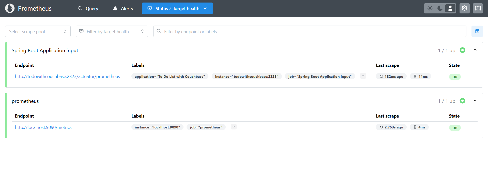
    <p> Figure 5 </p>
    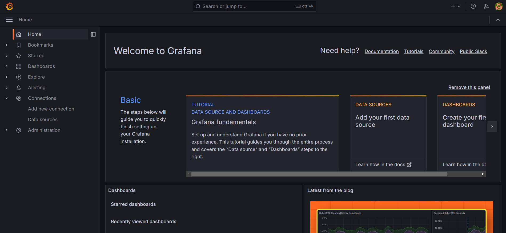
    <p> Figure 6 </p>
    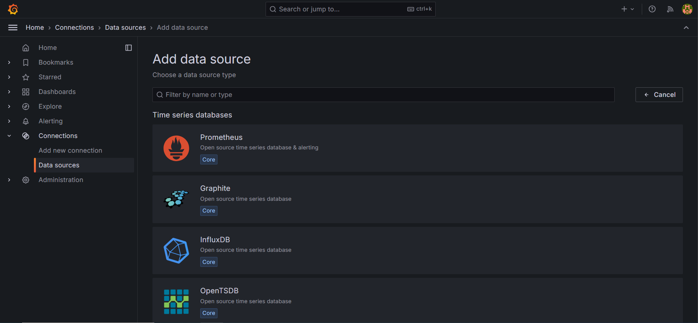
    <p> Figure 7 </p>
    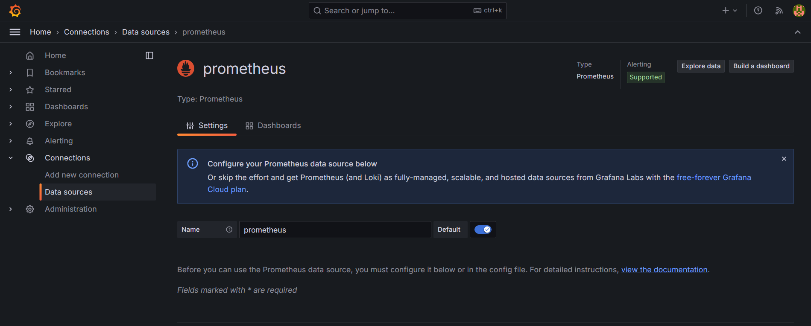
    <p> Figure 8 </p>
    
    <p> Figure 9 </p>
    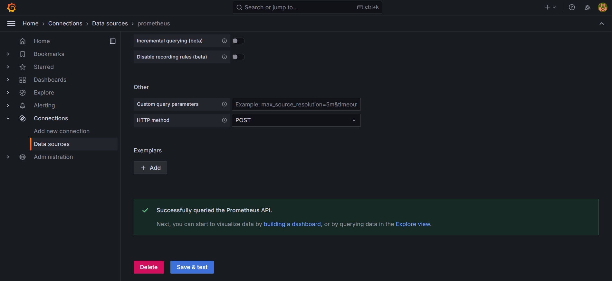
    <p> Figure 10 </p>
    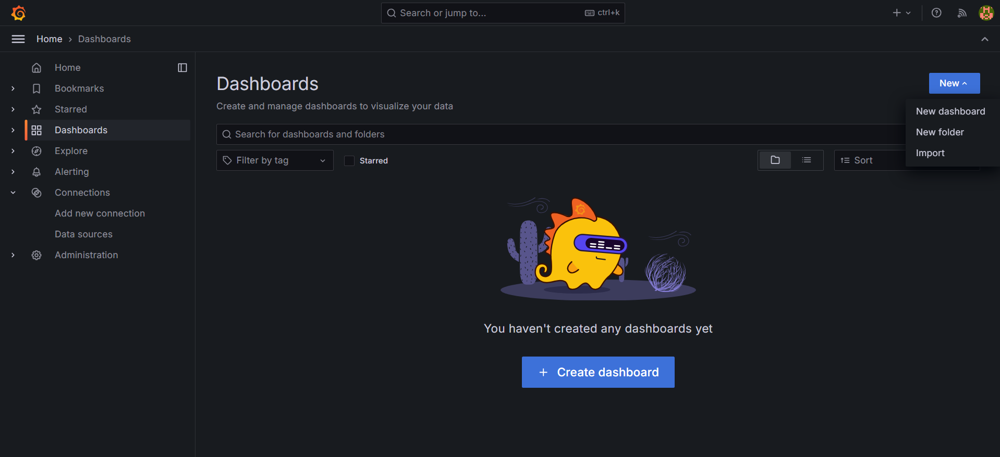
    <p> Figure 11 </p>
    
    <p> Figure 12 </p>
    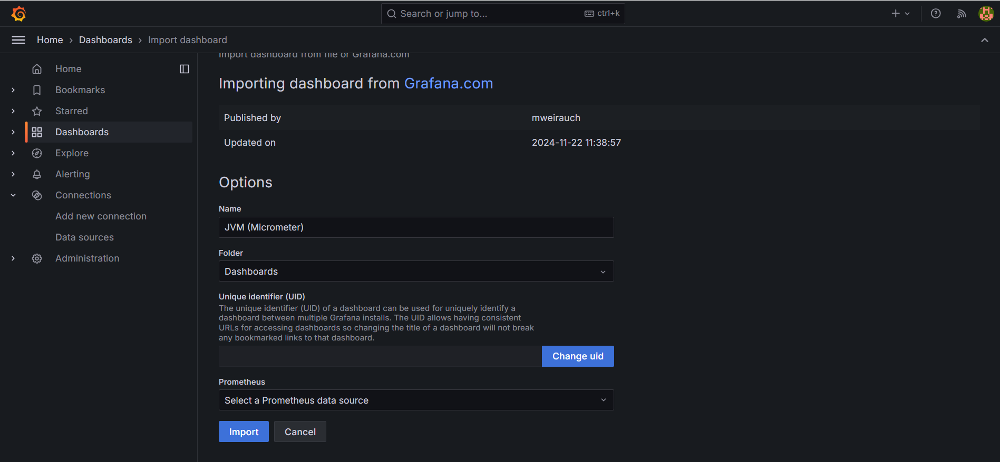
    <p> Figure 13 </p>
    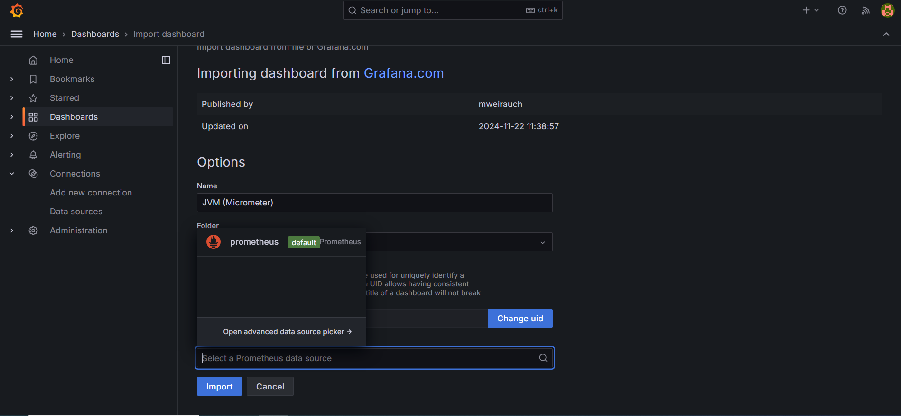
    <p> Figure 14 </p>
    
    <p> Figure 15 </p>
    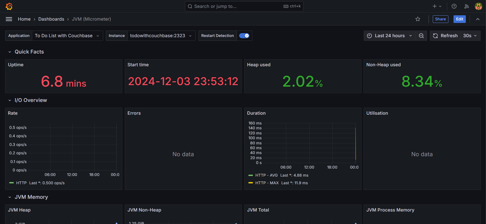
    <p> Figure 16 </p>
    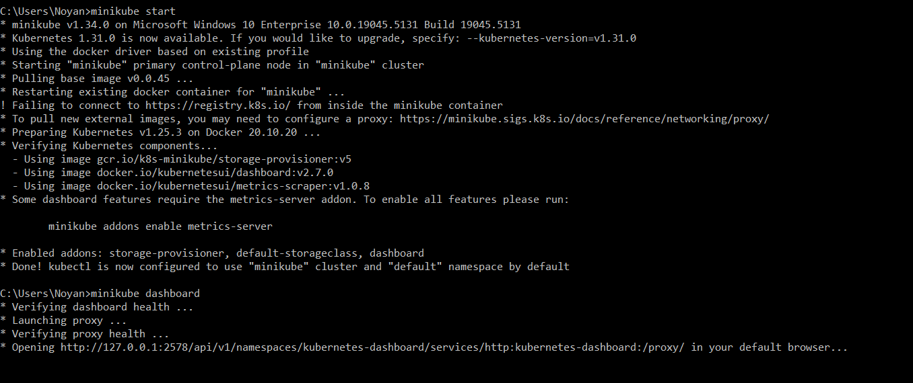
    <p> Figure 17 </p>
    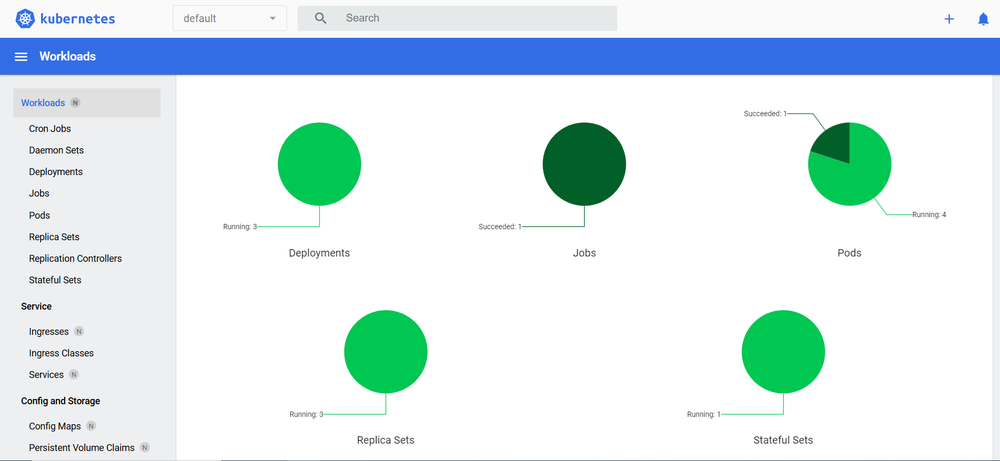
    <p> Figure 18 </p>
    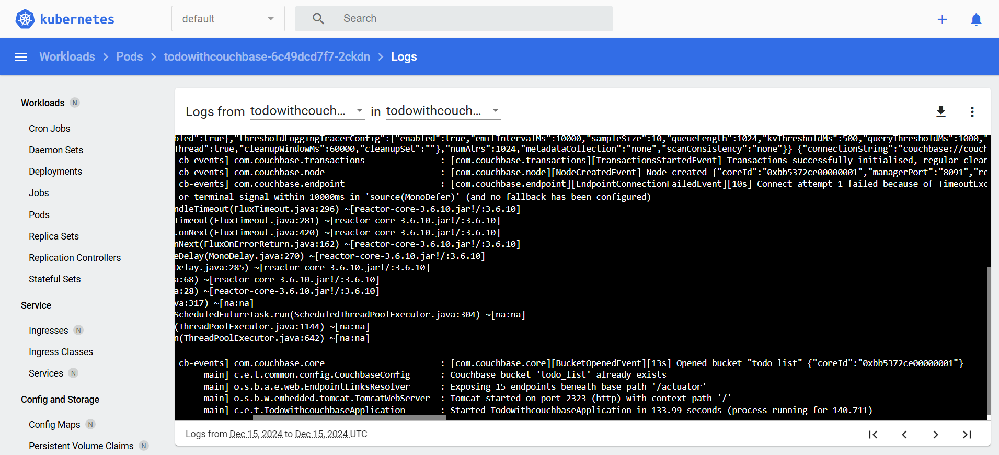
    <p> Figure 19 </p>
    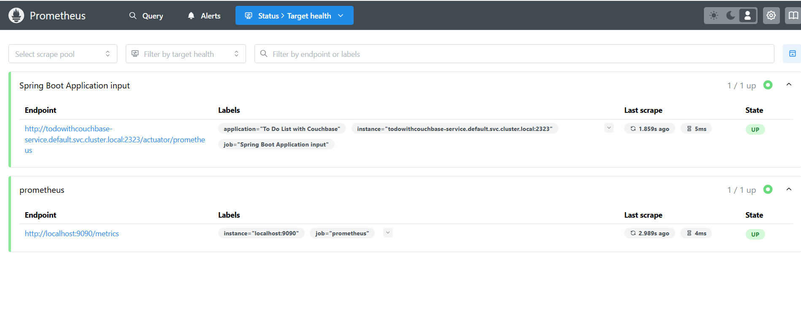
    <p> Figure 20 </p>
    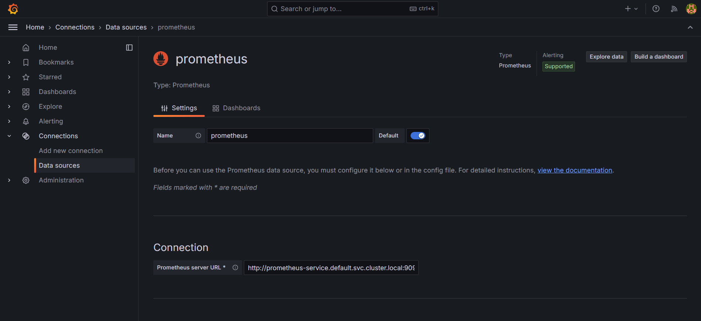
    <p> Figure 21 </p>
    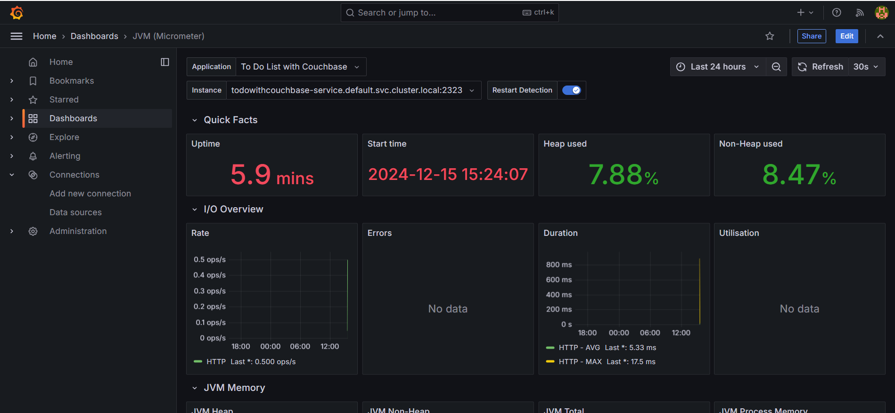
    
</details>


### Contributors

- [Sercan Noyan Germiyanoğlu](https://github.com/Rapter1990)
- [Furkan Tarık Göçmen](https://github.com/furkantarikgocmen)